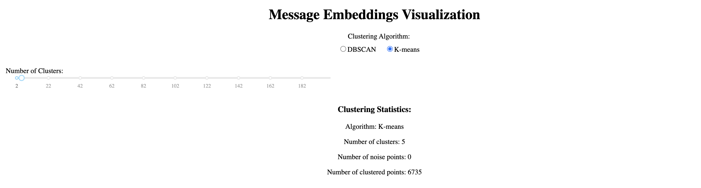

# embedding_telegram

[Русская версия](README_RU.md) | [English version](README.md)

## Project Description

This project is a visualization tool for Telegram chat messages that uses machine learning to analyze and cluster conversations. It processes your Telegram chat export and creates an interactive visualization where similar messages are grouped together.

Key features:
- Processes Telegram chat exports in JSON format
- Uses the Granite embedding model to convert messages into vector representations
- Visualizes message embeddings in 2D space using t-SNE
- Provides interactive clustering using DBSCAN or K-means algorithms
- Allows real-time adjustment of clustering parameters
- Shows message content on hover
- Option to generate new embeddings or use existing ones

## Screenshot

## Installation

1) Install [uv](https://github.com/astral-sh/uv) and [python](https://www.python.org/)
2) Download and extract the repository
3) Run the following commands:
   - `uv venv`
   - for macOS/Linux `source .venv/bin/activate`
   - for Windows `.venv\Scripts\activate` (in PowerShell)
   - `uv sync`
5) For running the embedding model, I use lm studio and the model `granite-embedding-278m-multilingual-GGUF/granite-embedding-278m-multilingual-Q8_0.gguf`
6) Run `python3 show.py`
7) Open `localhost:8052` in your browser
8) Export your Telegram chat in "machine-readable JSON" format and upload it to the browser
9) Click `Go to visualization`
10) Clustering parameters are available at the top, see their description below

## Embedding Generation Options

When uploading a file, you have two options:
1. **Generate new embeddings** - generates new embeddings for the uploaded file (may take some time)
2. **Use existing embeddings.json** - uses an existing embeddings.json file (if it exists in the project directory)

If you choose the second option, make sure the embeddings.json file exists in the project directory.

## Clustering Algorithms

The application provides two clustering algorithms:

### DBSCAN (Density-Based Spatial Clustering of Applications with Noise)

DBSCAN groups points that are close to each other and marks points in low-density regions as noise.

Parameters:
- **EPS (Epsilon)** - maximum distance between two points to be considered neighbors
  - Smaller values create more small clusters
  - Larger values create fewer but larger clusters
  - Range: 0.1 - 3.0
- **Min Samples** - minimum number of points required to form a cluster
  - Smaller values create more clusters
  - Larger values create more stable clusters
  - Range: 1 - 20

### K-means

K-means divides data into K clusters, where each point belongs to the cluster with the nearest mean.

Parameters:
- **Number of Clusters** - number of clusters to divide the data into
  - Smaller values create more general groups
  - Larger values create more specific groups
  - Range: 2 - 200

### Algorithm Selection Guidelines

- Use **DBSCAN** if:
  - You don't know the number of clusters in advance
  - You want to find clusters of arbitrary shape
  - You want to automatically detect outliers (noise)

- Use **K-means** if:
  - You know the approximate number of clusters
  - You expect clusters to be roughly equal in size
  - You want more predictable results
