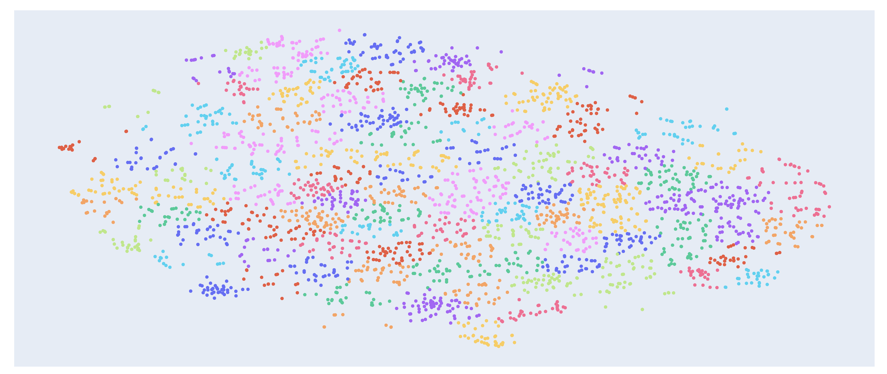
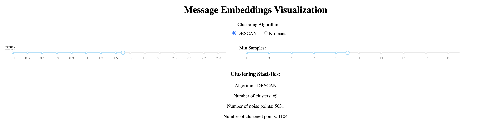

# embedding_telegram

[English version](README.md) | [Русская версия](README_RU.md)

## Описание проекта

Этот проект представляет собой инструмент визуализации сообщений Telegram, использующий машинное обучение для анализа и кластеризации переписок. Он обрабатывает экспорт чата Telegram и создает интерактивную визуализацию, где похожие сообщения группируются вместе.

Основные возможности:
- Обработка экспорта чата Telegram в формате JSON
- Использование модели Granite для преобразования сообщений в векторные представления
- Визуализация эмбедингов сообщений в 2D пространстве с помощью t-SNE
- Интерактивная кластеризация с использованием алгоритмов DBSCAN или K-means
- Возможность настройки параметров кластеризации в реальном времени
- Отображение содержимого сообщений при наведении
- Опция генерации новых эмбедингов или использования существующих

## Скриншот

## Установка

1) Вам необходимо установить [uv](https://github.com/astral-sh/uv) и [python](https://www.python.org/)
2) Скачайте и распакуйте репозиторий на диск
3) Выполните следующие команды: `uv venv`, для macOS/Linux `source .venv/bin/activate`, `uv sync`
4) Для запуска embedding модели я использую lm studio и модель `granite-embedding-278m-multilingual-GGUF/granite-embedding-278m-multilingual-Q8_0.gguf`
5) Запустите `python3 show.py`
6) Откройте в браузере `localhost:8052`
7) Далее вам необходимо экспортировать переписку telegram в "машиночитаемом json" и загрузить ее в браузер
8) После нажимайте `Go to visualization`
9) В верхней части есть параметры кластеризации, ниже есть их описание

## Опции генерации эмбедингов

При загрузке файла у вас есть два варианта:
1. **Generate new embeddings** - генерирует новые эмбединги для загруженного файла (может занять некоторое время)
2. **Use existing embeddings.json** - использует уже существующий файл embeddings.json (если он есть в директории проекта)

Если вы выбрали второй вариант, убедитесь что файл embeddings.json существует в директории проекта.

## Алгоритмы кластеризации

В приложении доступны два алгоритма кластеризации:

### DBSCAN (Density-Based Spatial Clustering of Applications with Noise)

DBSCAN группирует точки, которые находятся близко друг к другу, и помечает как шум точки, которые находятся в областях с низкой плотностью.

Параметры:
- **EPS (Epsilon)** - максимальное расстояние между двумя точками, чтобы они считались соседями
  - Меньшие значения создают больше маленьких кластеров
  - Большие значения создают меньше, но более крупных кластеров
  - Диапазон: 0.1 - 3.0
- **Min Samples** - минимальное количество точек, необходимое для формирования кластера
  - Меньшие значения создают больше кластеров
  - Большие значения создают более устойчивые кластеры
  - Диапазон: 1 - 20

### K-means

K-means делит данные на K кластеров, где каждая точка относится к кластеру с ближайшим средним значением.

Параметры:
- **Number of Clusters** - количество кластеров, на которые нужно разделить данные
  - Меньшие значения создают более общие группы
  - Большие значения создают более специфичные группы
  - Диапазон: 2 - 200

### Рекомендации по выбору алгоритма

- Используйте **DBSCAN**, если:
  - Вы не знаете заранее количество кластеров
  - Хотите найти кластеры произвольной формы
  - Хотите автоматически определять выбросы (шум)

- Используйте **K-means**, если:
  - Вы знаете примерное количество кластеров
  - Ожидаете, что кластеры будут примерно одинакового размера
  - Хотите более предсказуемый результат 